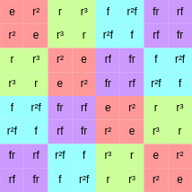

## Introduction to multiplication tables

The multiplication table is probably the most widely used tactic for
depicting a group operation.  Let's take a look at some of its potential.
If you have not yet encountered the multiplication table
[visualizer](rf-geterms.md#visualizers), start with these help pages:

 * [The definition of a multiplication table](rf-groupterms.md#multtable)
 * [The documentation on the multiplication table interface in
   *Group Explorer*](rf-um-mt-options.md)

## What multiplication tables do well

Coloring the backgrounds of multiplication tables' cells reveals patterns in
the group operation.  Let's illustrate this by contrasting
a bad example with a good one.

### Bad example

The backgrounds of the cells in this multiplication table are colored based
on whether they are in a particular 2-element subgroup. This does not look
as helpful in a multiplication table as it does in a [cycle
graph](rf-groupterms.md#cyclegraph) or [Cayley
diagram](rf-groupterms.md#cayleydiagram), because each element appears
multiple times in a multiplication table.

### Good example

The backgrounds of the cells in this multiplication table are colored based
on their membership in the [cosets](rf-groupterms.md#cosets) of the
[subgroup](rf-groupterms.md#subgroup) highlighted in red. This shows how the
group operation in this example respects the cosets nicely--in fact, by
considering each block of like-colored neighbors as one big cell, one can
see the multiplication table of the [quotient
group](rf-groupterms.md#quotient)! The subgroup in question is therefore
[normal](rf-groupterms.md#normalsubgroup).

### Exercise

Consider it an exercise to find a group with a non-normal subgroup and
highlight a multiplication table of that group by the cosets of the
non-normal subgroup.

There are some illustrations can be made from just about any kind of
visualization, including multiplication tables.  For instance, we can use
multiplication tables to illustrate [a lattice of
subgroups](s_3_multtable_lattice.png) or [a short exact sequence of
groups](s_3_multtable_ses.png), or we could use another kind of
visualization as well.  Both of these advanced uses of multiplication tables
tie in homomorphisms, which are visible on [sheets](rf-um-sheetwindow.md).
