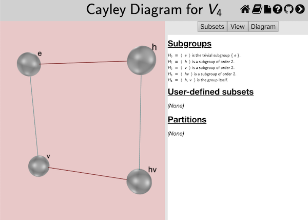
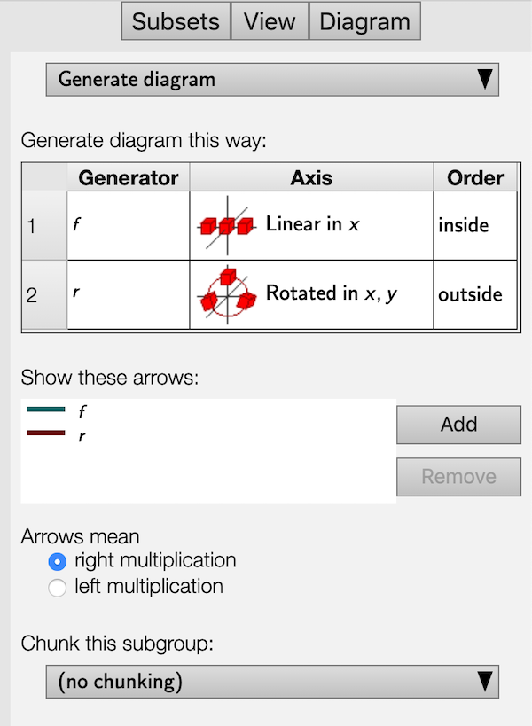
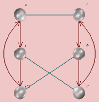
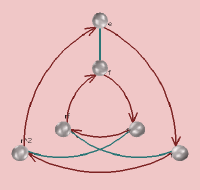
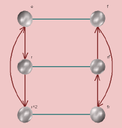
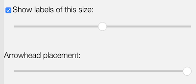

This page documents the interface for the large view of a [Cayley
diagram](rf-groupterms.md#cayley-diagrams). A Cayley diagram is one of
*Group Explorer's* four [visualizers](rf-geterms.md#visualizers), all of
which can appear either in [group info pages](rf-um-groupwindow.md),
[sheets](rf-geterms.md#sheets), or in their own pages. When they appear in
their own pages, this is refered to as a "large view," and you can read
about it in general [here](rf-um-largewindow.md). This page covers the
specifics for large views of Cayley diagrams.

## Choosing which diagram to view

There are two types of Cayley diagrams available in *Group Explorer,* the
kind you instruct *Group Explorer* to construct for you and the kind that
was designed in advance by the [author of the group
file](rf-geterms.md#author-of-a-group). Most group files do not come with
diagrams defined by the author, but *Group Explorer* can construct Cayley
diagrams for any group in its library, so no group will be without a
diagram.

The top of the Diagram tab (the third of the three tabs in the right hand
pane) allows you to choose a diagram from a drop-down list. The items in the
list are one of two types.

 * The first item in the list reads "Generate diagram"
   and instructs *Group Explorer* to generate a Cayley diagram
   according to the instructions you provide
   in the other controls on the diagram page, specifically the
   [generation table](#generators-and-assigning-them-priority-axes-and-an-order).
 * The other items on the list instruct *Group Explorer*
   to load a diagram defined by the group author.
   In doing so, you will disable the controls for
   [generating](#generators-and-assigning-them-priority-axes-and-an-order)
   and [chunking](#chunking) in the diagram.

## Viewing the diagram

A Cayley diagram (unlike multiplication tables and cycle graphs) is a
three-dimensional structure. Thus you can left-click and drag [one-finger drag]
on the view to rotate it in three-dimensional space; you can right-click and
drag [two-finger drag] to translate it; and you can use the mouse wheel [pinch
open/close] to zoom in and out. This lets you see all sides of the
diagram, and seeing it in motion can give you a better mental picture of it.

## Changing the positions of nodes in the diagram

You can customize the appearance of any Cayley diagram by dragging the nodes
in it around in three dimensions to any position you like. To drag the nodes
around, hold the shift key while you click on the node and drag. It will
move in the plane parallel to the screen. To reset the diagram to its
original configuration, simply reload the page in your browser.

Note that because [chunking](#chunking) depends on the positions of nodes in
the diagram, if you reposition the nodes in this way you will not be able to
chunk cosets without allowing *Group Explorer* to put the nodes back to
their original position.

## Changing the arcing of arrows in the diagram

You can customize the degree to which the arcs and arrows in the diagram are
curved. Usually an arc in the diagram takes a straight path from its source
node to its destination node. The exceptions to this are when the diagram is
inherently round, and so the arrows follow the curvature of the diagram, or
when there are nodes in the way and a curved path would avoid them.

However you can feel free to improve on *Group Explorer*'s decisions in this
matter by clicking on an arc in the diagram while holding down the shift
key, and dragging to increase or decrease the amount of arcing it has. You
will not be able to change the direction of the arcing, only its amount.

## The Diagram tab

Note that the controls panel for Cayley diagram large views has three tabs
at the top: Subsets, View, and Diagram.

The Subsets tab allows you to compute and highlight subsets of the group,
and the View tab allows you to change some cosmetic options of the diagram;
[see below for information on each of these tabs](#related-interfaces).

The Diagram tab allows you to choose a predefined diagram to view or specify
parameters for how *Group Explorer* should construct a diagram for you. This
section describes the controls on the Diagram tab.

### Organizing by a subgroup

The most common way a user reorganizes a diagram is to focus on a particular
subgroup. *Group Explorer* therefore has a shortcut for this purpose, to
alleviate wading through the technical options documented below.
Clicking [tapping] anywhere in the generator table
brings up a menu whose last item is "Organize by." Choosing that option
lists all the subgroups by which one can organize the Cayley diagram.
Selecting one reorganizes the entire generator table (and therefore the
diagram) to bring together the elements in the subgroup and in each of its
cosets. Further tweaking of the axes assigned to each generator may be
necessary to get the diagram to look exactly the way you like, but this
shortcut can save a lot of time.

It is particularly useful in examining whether a subgroup is
[normal](rf-groupterms.md#normal-subgroup). When the diagram is organized by
the subgroup and its cosets, is it clear that the arrows for generators that
connect one coset to another agree on where each coset should be mapped?

### Generators, and assigning them priority, axes, and an order

*Group Explorer* takes three factors into account when generating a
diagram--a list of generators for the group, an axis for each generator, and
an order for nesting those axes. Each of these options is specified in the
table titled "Generate diagram this way:" in the image above. Let us
consider each of these options here.

#### A list of generators for the group

The leftmost column in the table lists generators for the group. The order
is significant when the group is nonabelian. You can select new generators
by clicking [tapping] on a generator and selecting a
new one from the list. When you are choosing generator \(n\), only the
elements not in the subgroup generated by generators 1 through \(n-1\) are
available as options. You can reorder the generators in the table by
clicking a row header (numbered 1, 2, ...) and dragging [one-finger dragging] it up or down.

The first step *Group Explorer* peforms (invisibly) when generating a Cayley
diagram is to arrange the elements of the group into a grid without
assigning them positions in space. Generators that are higher in the table
are used to generate local regions of that grid, and those that are lower in
the table are used to expand local regions to the global diagram. For
instance, here is a comparison of two different choices of generators for
the group
[\(S_3\)](http://nathancarter.github.io/group-explorer/GroupInfo.html?groupURL=groups/S_3.group).
(Note that \(rf = fr^2\) and \(fr = r^2f\), and we assume right
multiplication in both cases.)

 * Using generators \(r\) and \(f\) (in that order)
   creates an internal table that looks like the following.
   \[\begin{array}{ccc} e & r & r^2 \\ f & fr & fr^2 \end{array}\]
 * It generates diagrams like those shown below,
   depending on the choice of axes.

    
    

 * Using generators \(f\) and \(r\) (in that order)
   creates an internal table that looks like
   \[\begin{array}{cc} e & f \\ r & rf \\ r^2 & r^2f \end{array}\]
 * It generates diagrams like those shown below,
   depending on the choice of axes.

    
    

The following section explains the choice of axes.

#### An axis for each generator

The second column in the generation table shows axes graphically, one for
each generator. These determine how the tables of elements discussed above
will be laid out in space.

 * In each pair of diagrams above, the diagram on the left was
   generated by assigning:
    * the generator \(r\) to the axis "linear in \(y\),"
      depicted by the following icon,

        

    * and the generator \(f\) to the axis "linear in \(x\),"
      depicted by the following icon.

        

      You can see how the \(r\) arrows move vertically
      and the \(f\) arrows move horizontally, respecting this setting.

 * But the diagram on the right of each pair was generated by assigning:
    * the generator \(r\) to the axis "rotated in \(x,y\),"
      depicted by the following icon,

        

    * and the generator \(f\) to the axis "linear in \(y\),"
      depicted by the following icon.

        

      You can see how the \(f\) generators are vertical at the top of the
      diagram, near the identity element, thus obeying the assignment to
      the "linear in \(y\)" axis.

#### An order for nesting the axes

Even having chosen all of the above options does not completely determine
how the diagram should be laid out in space. For instance, in the round
diagrams above the user chose one linear axis and one rotational axis. How
did *Group Explorer* know to make it a ring of lines as opposed to a line of
rings? The answer is that the \(f\) generator was marked "inside" and the
\(r\) generator was marked "outside" in the order column.

Choosing different options yields different diagrams, as shown below.

A ring of lines

A line of rings

_Note: If the order is changed from the default (which has the innermost
generator on top, down to the outermost on bottom) then chunking will be
disabled._ The reason for this is that with some more complex groups, if the
order of generation does not match the order of nesting of the axes, chunks
could take on complex shapes that would need to twist to avoid one another.
See [Chunking](#chunking), below.

### Arrows

You can put into a Cayley diagram a set of arrows representing any element
in the group except the identity. Each new set of arrows will be a different
color. You can include as many or as few sets as you like, and *Group
Explorer* automatically colors them with hues as far apart in the spectrum
as it can (given how many different types of arrows you require).

Custom Cayley diagrams come with their own lists of default arrow sets, but
you can still add or remove them after you have displayed the custom
diagram. Auto-generated diagrams, by default, use one type of arrow for each
generator in the table at the top of the Diagram tab; again, add and remove
as you like.

You can also choose whether arrows indicate right multiplication by a
generator or left multiplication. By default, *Group Explorer* assumes right
multiplication and the predefined Cayley diagrams shipped with *Group
Explorer* use right multiplication. They may look bad if you change the
arrows to mean left multiplication.

You can also control the placement of arrowheads from the View tab; [see
below](#related-interfaces).

### Chunking

When trying to visualize the cosets of a subgroup, it can be useful to have them grouped visually. This option is available in both multiplication tables and Cayley diagrams, two situations in which such an organization is possible. Chunking cosets in a Cayley diagram means wrapping them in semi-transparent boxes which group the nodes of the cosets. For example, consider the grouping of two-element cosets of the subgroup \(\{ e, f \}\) in [\(S_3\)](http://nathancarter.github.io/group-explorer/GroupInfo.html?groupURL=groups/S_3.group) shown below.

To choose which subgroup's cosets should be chunked, simply choose the
subgroup from the drop-down list at the bottom of the Diagram tab. Note that
which subgroups are available is determined by the structure of the diagram,
which is determined by the order of generators. If the generators are
\(a,b,c,d\) (in that order) then the only cosets available for chunking will
be \(\langle d \rangle\), \(\langle c,d \rangle\), \(\langle b,c,d
\rangle\), and the whole group \(\langle a,b,c,d \rangle\).

Note also that chunking is disabled when the order of generation of the
diagram does not match the order of nesting of the axes; [see more
information above](#an-order-for-nesting-the-axes).

CITE(VGT-8.2 MM-4 DE-9)

## Related interfaces

The controls in the Subsets tab on the right side of the large window for
Cayley diagrams are described in [the help page for subset
controls](rf-um-subsetlistbox.md).

The controls in the View tab on the right side of the large window for
Cayley diagrams are described in [the help page for three-dimensional
controls](rf-um-modelview.md), with the exception of two controls specific
to Cayley diagrams, shown below.

Use the checkbox next to the phrase "Show labels of this size:" to turn on
or off the text next to each node in the diagram, which labels the node with
the name of the element that it represents.

The slider beneath the phrase "Show labels of this size:" decides the size
of the font used in the labels. Moving the slider to the left gives small
fonts, and to the right large fonts.

You can control the placement of arrowheads along arcs in the diagram by
dragging the "Arrowhead placement" slider. When it is at its right extent,
arrowheads are abutted against the destination node of the arc; when it is
at its left extent, they are near the source node.
