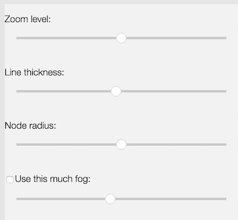

Any three-dimensional [visualizer](rf-geterms.md#visualizers) in *Group
Explorer* will have a panel like the one shown below for adjusting the
properties of the three-dimensional object in view. [Cayley
diagrams](rf-groupterms.md#cayley-diagrams) and [objects of
symmetry](rf-groupterms.md#objects-of-symmetry) are three-dimensional views.

The "Zoom level" slider determines how large the three-dimensional object
will seem. It operates just like the zoom on a camera, with the left end
being "zoomed out" and the right end being "zoomed in."  You can also zoom
in and out with your mouse wheel.

The "Line thickness" slider determines how strongly the lines in the
three-dimensional scene are drawn. The left end is faint lines, the right
end is bold lines.

The "Node radius" slider determines the base size of any nodes (spheres) in
the scene. Not all nodes will be the same size, but this is the base size
from which all sizes are calculated. Left means smaller, right means larger.

The "Use this much fog" checkbox indicates whether fog should be turned on
in the scene.

"Fog" is usually the term used in video games; in scientific applications,
it is more commonly called "depth cueing," because a faint haze in the scene
(which increases with depth) helps the viewer judge how far into the scene
various objects (or portions of objects) are. The left end of the slider
means very little depth cueing (or fog) should be used, and the right end
gives more.
