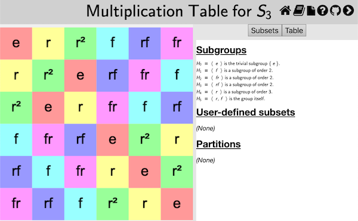
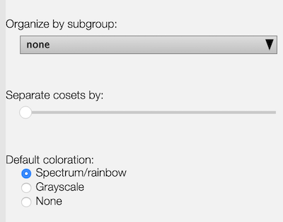

This page documents the interface for the large view of a [multiplication
table](rf-groupterms.md#multiplication-table). A multiplication table is one
of *Group Explorer's* four [visualizers](rf-geterms.md#visualizers), all of
which can appear either in [group info pages](rf-um-groupwindow.md),
[sheets](rf-geterms.md#sheets), or in their own pages. When they appear in
their own pages, this is refered to as a "large view," and you can read
about it in general [here](rf-um-largewindow.md). This page covers the
specifics for large views of multiplication tables.

## Reordering header row or header column

You can choose the order of elements along the top row (or left column) of
the multiplication table using your mouse. (Note that order of elements in
the top row and left column determine the contents of the rest of the table.
*Group Explorer* fills it out using the group operation.)

To move an element from one point to another in the top row, shift-click on
the element's cell in the table and drag your mouse to the new position
(left or right in the top row). To move an element in the left column, the
procedure is the same, except vertical. Note that the top row and left
column will stay synchronized, so no matter which one you reorder, both will
change.

You can also ask *Group Explorer* to organize the top row/left column of the
table according to a particular subgroup and its cosets; [see
below](#organization-by-subgroup).

## Magnification

You can zoom in and out of multiplication tables with your mouse wheel.

The center of zooming is always the center of the view, so if you wish to
zoom around a different center, first click and drag to move that point to
the center of the view, then you can zoom in and out centered on that point.

To restore the default magnification level (which fits the whole table into
the view), right-click (control click on Mac) anywhere in the table.

## The Table tab

The controls panel for multiplication table large views has two tabs at the
top: Subsets and Table. The first of these allows you to highlight subsets
of the group in the table; [see below for information on that
tab](#related-interfaces). The second of these allows you to change the
structure or appearance of the table in other ways. This section describes
those controls.

### Organization by subgroup

By default, the "Organize by subgroup:" drop-down list at the top of the
Table tab has "none" selected. However, if you wish to organize the top row
(and left column) of the multiplication table so that a particular subgroup
is at the left (top) and its cosets follow it one after the other, you can
choose that subgroup from this drop-down list.

You can also choose the exact order of the elements in the top row or left
column of the table manually; [see
above](#reordering-header-row-or-header-column).

### Separation of cosets

If you have made a selection on the "Organize by subgroup:" drop-down list
([see above](#organization-by-subgroup)), then *Group Explorer* also enables
you to put some vertical and horizontal space between the cosets in the
multiplication table, to help the viewer visually separate them. The slider
under the "Separate cosets by:" header determines how much space (the
leftmost extreme is zero, no space, the default).

This is especially useful when the subgroup in question is normal, because
it helps visualize the quotient group. As an example, consider [this
multiplication table](d_4_multtable_organized.png) illustrating the quotient
of \(D_4\) by \(\mathbb{Z}_2\).

CITE(VGT-7.3 MM-3.5 DE-8.2)

### Colorization scheme

There are three colorization schemes for multiplication tables:

*   Spectrum/rainbow
*   Grayscale
*   None

The first is the default, and makes multiplication tables use all the hues
in the color spectrum, as in the first illustration on this page. Grayscale
is appropriate if you intend to print on a black-and-white printer; the
colors of gray contrast better than the rainbow hues, which all have the
same saturation and intensity. Choosing None makes the multiplication table
just black text on white background.

Note that the colorization scheme you choose is overridden by any
highlighting you do on the Subsets tab, documented on a separate page, as
indicated below.

## Related interfaces

The controls in the Subsets tab on the right side of the large window for
multiplication tables are described in [the help page for subset
controls](rf-um-subsetlistbox.md).
