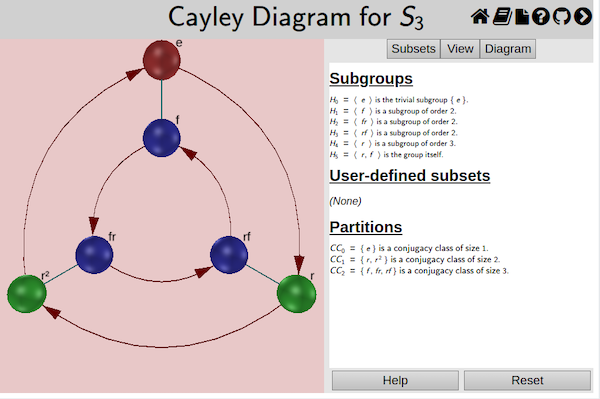

## Manipulating Cayley Diagrams

The Cayley diagram is the clearest [visualizer](rf-geterms.md#visualizers)
for depicting groups as sets with structure. They also clearly show the
group as acting on itself. Here we will concentrate on the basic
manipulations you might want to perform on a Cayley diagram as you
investigate that group.

For more introductory information on Cayley diagrams, refer to [the
definition of a Cayley diagram](rf-groupterms.md#cayleydiagram) or [a quick
introduction to Cayley diagrams](gs-cd-intro.md). For more complete
information on the Cayley diagram interface, refer to [the relevant section
of the user manual](rf-um-cd-options.md).

## Rotating

Because a Cayley diagram can be three-dimensional, you may want to rotate it
around to get a better look at it from all sides. To do so, simply **click
and drag on the diagram.**

## Highlighting

You can highlight the nodes in the Cayley diagram according to properties of
the group elements they represent. This can be useful for studying different
properties of the group. **Right-click on a subset in the Subsets tab of the
controls and choose from among the highlighting options** -- node color
, ring around
the node , and square around the node .

See the example below, which highlights each conjugacy class a different
color, thereby exhibiting a class equation visually.

For more full documentation on the Subsets tab, refer to [the relevant section of the user manual](rf-um-subsetlistbox.md).

## Chunking

To help you better visualize the cosets of a particular subgroup, you can
proceed by a two-step process. **First, choose generators in the generator
table at the top of the Diagram tab** so that your subgroup's generators are
first in the table. **Then choose your subgroup from the list at the bottom
of that tab** to visually separate the cosets of your subgroup with
translucent gray boxes.

The Diagram tab and the generator table are quite intricate. For full
details, refer to [the documentation on the interface for Cayley
diagrams](rf-um-cd-options.md).

CITE(VGT-7.3 MM-3.5 DE-8.2)
